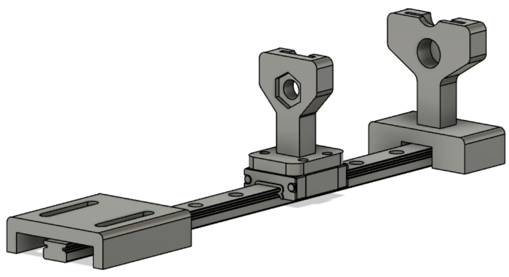

# Haptic Glove Project

The haptic glove project is one of the projects I worked on during my time as an intern at the Home Team Science & Technology Agency (HTX).

## Objective

To use a force touch sensor to provide an equivalent force (haptic feedback) on the user’s fingers fitted in a glove.

## Description

This project involves using syringes which pump in air to silicon sockets attached to the gloves' fingers. The syringes will be positioned on a 3D printed holder, one for the front and another for the back. The back holder is the only movable piece, as it is attached directly to a linear guide rail at the bottom via M3 fasteners. A hexagonal nut hole was precisely designed in the middle for a nut to be placed. This nut will be attached to a threaded rod, which in turn, is coupled to a stepper motor.

A force sensing resistor will detect the amount of force exerted on the resistor, which is translated to a suitable number of steps value for the stepper motor to move.

